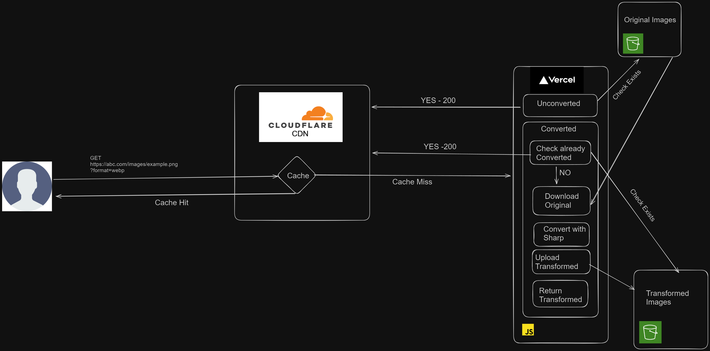

# Nimbus

**Nimbus** is a powerful and scalable platform for converting images on-the-fly using the Sharp library. By simply providing a URL string, users can dynamically resize, crop, and transform images, which are then delivered through a custom architecture built on Vercel and Cloudflare. The original images are stored securely in AWS S3.

## Features

- **Dynamic Image Processing**: Convert and transform images using URL parameters.
- **Scalable Architecture**: Built on top of Vercel and Cloudflare for fast and reliable delivery.
- **Secure Storage**: Images are securely stored in AWS S3.
- **High Performance**: Leveraging the Sharp library for efficient image processing.

## Architecture 
This is the architecture diagram of Nimbus.


## Installation

To set up Nimbus locally, follow these steps:

1. **Clone the repository:**

    ```bash
    git clone https://github.com/yourusername/nimbus.git
    cd nimbus
    ```

2. **Install dependencies:**

    ```bash
    npm install
    ```

3. **Set up environment variables:**

    Create a `.env` file in the root directory and configure the following variables:

    ```env
    AWS_ACCESS_KEY_ID=your_aws_access_key
    AWS_SECRET_ACCESS_KEY=your_aws_secret_key
    S3_BUCKET_NAME=your_s3_bucket_name
    S3_REGION=your_s3_region
    ```

4. **Run the development server:**

    ```bash
    npm run dev
    ```

5. **Build for production:**

    ```bash
    npm run build
    ```

Alternatively, use it from [https://nimbus.sbn.lol/](https://nimbus.sbn.lol/) with the UI.


## Usage

Once the server is running, you can start processing images by providing a URL string with the required parameters.

### Example URL

```bash
https://nbs.sbn.lol/image.png?url=https://example.com/image.jpg&width=500&height=500&format=png
```

### Parameters

- `url`: The URL of the image to be processed.
- `width`: The desired width of the output image.
- `height`: The desired height of the output image.
- `format`: The output image format (e.g., `jpeg`, `png`, `webp`).
- `quality`: Takes any value from `1-100`.

### Response

The server will return the processed image with the specified dimensions and format.

## API Endpoints

### `GET /[slug]`

Converts an image based on the provided query parameters.

#### Query Parameters:

- **`url`** (required): The URL of the image to convert.
- **`width`** (optional): The desired width of the image.
- **`height`** (optional): The desired height of the image.
- **`format`** (optional): The desired format of the image (`jpeg`, `png`, `webp`).

### Example Request

```bash
GET https://nbs.sbn.lol/image.png?url=https://example.com/image.jpg&width=500&height=500&format=png
```


## Contributing

Contributions are welcome! If you’d like to contribute to Nimbus, please follow these steps:

1. Fork the repository.
2. Create a new branch (`git checkout -b feature-branch`).
3. Make your changes.
4. Commit your changes (`git commit -m 'Add some feature'`).
5. Push to the branch (`git push origin feature-branch`).
6. Open a pull request.

Please ensure your code follows the project's coding standards and includes tests where applicable.

## License

This project is licensed under the MIT License - see the [LICENSE](LICENSE) file for details.
